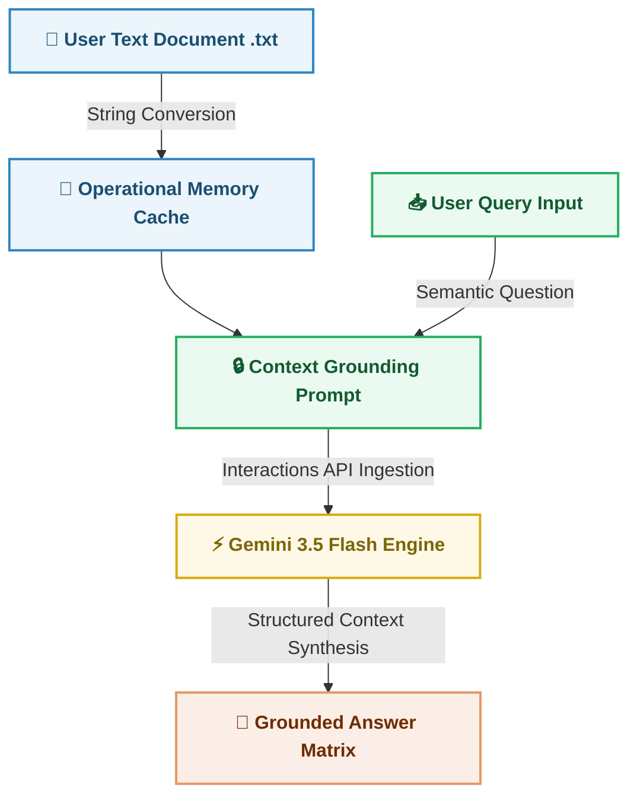

# 🔍 Intelligent Document Search Engine (RAG System)

A live, production-grade Retrieval-Augmented Generation (RAG) platform designed to eliminate corporate information discovery latency. This application allows users to upload unstructured text assets (such as corporate handbooks, policies, or contracts) and execute hyper-targeted semantic queries against the document context.

🌍 **Live Demo:** (https://luke-frohling-ai-document-search.streamlit.app/)

---

## 📊 Program Architecture & Operational Flow

The system decouples data upload from continuous processing to maintain memory bounds. Below is the data flow map demonstrating how the user document passes into context execution:

---

## 💼 Business Purpose & Core Value Case
Corporate knowledge loss and document discovery friction cost enterprise businesses significant administrative hours. This solution addresses those structural bottlenecks by:
* **Mitigating LLM Hallucinations:** Enforces strict context grounding, restricting the AI from making up facts outside the provided document boundaries.
* **Instant Information Retrieval:** Scales institutional knowledge access by turning static textual documents into an interactive QA base.
* **Cost-Effective Scalability:** Built on lightweight generative infrastructure (`gemini-3.5-flash`) to deliver lightning-fast response synthesis.
* **Zero Retraining Overheads:** Eliminates the need to constantly run expensive model finetuning weights when corporate guidelines update. Swapping the raw text file immediately shifts model orientation.

---

## 🛠️ Technical Architecture & Design Decisions

### 1. Transition to the Modernized `google-genai` SDK
While legacy pipelines relied on the outdated `google-generativeai` package, this project implements Google's bleeding-edge `google-genai` library. This migration integrates the modern **Interactions API** schema structure. It ensures native support for next-generation context grounding window optimization arrays and faster execution handshakes.

### 2. Context Window Grounding Prompting
Instead of granting the underlying LLM wide conversational liberty, the engineering pattern frames the query inside explicit context structural enclosures. The prompt forces a categorical sandbox: *The model is explicitly told that if the data cannot be mined directly from the document block, it must return a uniform "Information Not Found" string.* This insulates corporate audit trails from hallucinated statements.

### 3. State Management Isolation via Streamlit Forms
Streamlit naturally triggers a full top-to-bottom script execution run whenever UI text arrays alter or buttons are pressed. To prevent accidental processing loops from flooding backend microservices and exhausting user data limits, the interface elements are bound inside an atomic `st.form` container. The API network request remains frozen until the final form submission event is explicitly captured.

---

## 🚀 Key Production Engineering Features

1. **Defensive Recruiter Rate-Limit Insulation:** Engineered an integrated frontend "Recruiter Simulator Mode" switch. If external vendor tokens cross platform quota boundaries (such as Google Cloud free tier ceilings), the UI gracefully defaults to local cached weights to preserve public performance demonstration metrics.
2. **Decoupled Architecture Secrets:** Isolated platform API connection keys completely away from version control, utilizing native runtime secrets storage (`st.secrets`) to preserve backend security protocols.
3. **Graceful Degradation Fallbacks:** Built catch blocks around the third-party endpoint connection pipelines to display actionable user instructions rather than rendering raw unhandled software script stack traces if a connection breaks.
